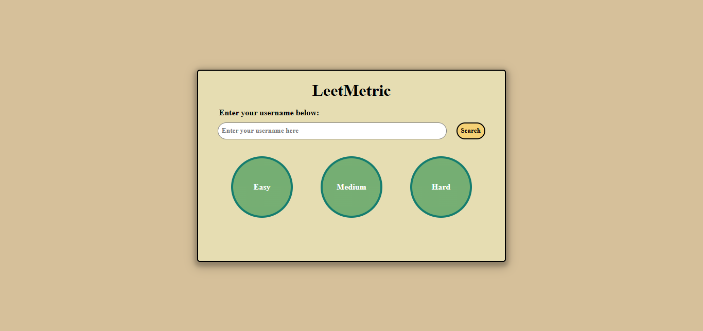
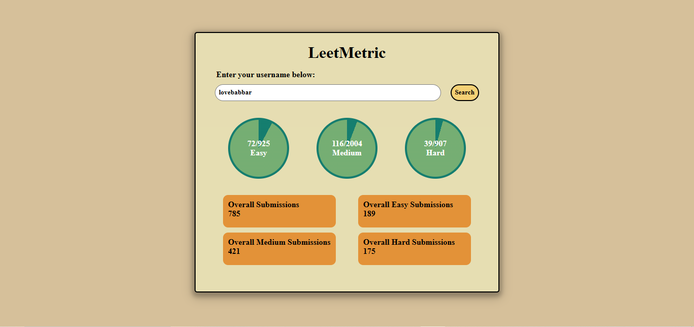

# 📊 LeetMetric – LeetCode Progress Tracker

**LeetMetric** is a clean and interactive web application that allows users to visualize their **LeetCode problem-solving progress** by simply entering their LeetCode username. The app fetches real-time data from LeetCode and presents it in an easy-to-understand visual format.

---

## 🔗 Project Overview

LeetMetric helps competitive programmers and learners track their performance across **Easy, Medium, and Hard** problems on LeetCode. Instead of manually checking profiles, users can instantly see solved problems, total available problems, and submission statistics in a single dashboard.

The project focuses on API integration, data visualization, and frontend interactivity using **Vanilla JavaScript**.

---

## ✨ Features

- Search LeetCode users by username  
- Real-time data fetching using LeetCode GraphQL API  
- Visual progress circles for Easy, Medium, and Hard problems  
- Displays solved vs total problems for each difficulty  
- Shows overall submission statistics  
- Input validation for usernames  
- Clean and responsive UI  

---

## 🛠️ Technologies Used

- **HTML5** – Structure of the application  
- **CSS3** – Styling, layout, and progress visuals  
- **JavaScript (ES6)** – API calls, logic, and DOM manipulation  
- **LeetCode GraphQL API** – Fetching user statistics  

---

## 🖼️ Screenshots

### Initial View


### User Statistics View


---

**⚠️ CORS Requirement (Important)**

This project fetches real-time data from LeetCode’s GraphQL API, which enforces strict CORS (Cross-Origin Resource Sharing) rules.
To avoid CORS-related errors while running this project locally or on static hosting, a temporary proxy server is required.

**🔹 Before Running the Project**

You must request access to the CORS Anywhere demo server by visiting the following link once in your browser:

👉 https://cors-anywhere.herokuapp.com/corsdemo

After clicking “Request temporary access”, refresh the LeetMetric application and search for a username again.

**🔹 Why This Is Needed**

LeetCode blocks direct client-side requests

Browsers restrict cross-origin API calls

CORS Anywhere acts as a temporary proxy to bypass these restrictions

## ⚙️ How It Works

1. Enter a valid LeetCode username.
2. Click on the **Search** button.
3. The app sends a GraphQL request to LeetCode.
4. Progress circles update based on solved problems.
5. Submission statistics are displayed in cards.

---

## 📂 Project Structure

```
LeetMetric/
├── index.html
├── style.css
├── script.js
├── leetmetric1.png
├── leetmetric2.png
└── README.md
```

---

## 🎯 Learning Outcomes

- Working with external APIs (GraphQL)
- Handling asynchronous JavaScript
- Dynamic UI updates with DOM manipulation
- Data visualization using CSS gradients
- Input validation and error handling

---

## 🚀 Getting Started

1. Clone the repository:
   ```bash
   git clone https://github.com/aqib897/leetmetric.git
   ```
2. Open `index.html` in your browser.
3. Enter a LeetCode username to view stats.

---

## 📜 Disclaimer

This project is for **educational purposes only** and is not officially affiliated with LeetCode.

---

### 👤 Author
**Aqib Shekh**

If you find this useful, consider giving the repository a ⭐
